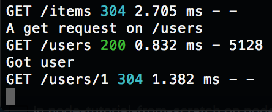

# playing with 3rd-party middleware [https://expressjs.com/en/resources/middleware.html](https://expressjs.com/en/resources/middleware.html)

In express, middleware are functions that get invoked in the router callbacks. There are several 3rd-party middlewares we can explore on the page linked above. In this demo we are implementing the [serve-favicon](https://expressjs.com/en/resources/middleware/serve-favicon.html) to serve the favicon and [morgan](https://expressjs.com/en/resources/middleware/morgan.html) to handle logs when api endpoints are hit.

## Example of `morgan('dev')` log

We will also move all middleware to a "middleware" directory to improve the server modularity.

