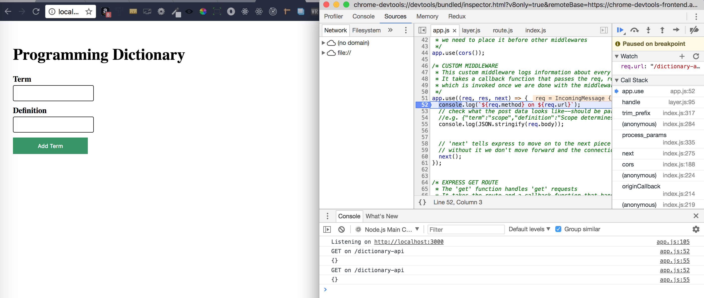

# debugging with the `--inspect` flag

To run the app in debug mode we just need to run the node command with the inspect flag as such `node --inspect app`. If we want to put a breakpoint right at the beginning of the app we can also pass the `--inspect-brk` flag in addition to `--inspect`.
So: `node --inspect --inspect-brk app`

When running in debug mode, node serves the app on the configured port and an additional port, with which we can interact.
 Several IDEs have tools that integrate with node's debug mode. We can also use the chrome inspect tools by opening this url: `chrome://inspect`.

e.g.
```bash
$ node --inspect app
Debugger listening on port 9229.
Warning: This is an experimental feature and could change at any time.
To start debugging, open the following URL in Chrome:
    chrome-devtools://devtools/bundled/inspector.html?experiments=true&v8only=true&ws=127.0.0.1:9229/758920b1-952b-4e6a-9757-e8ef0ce2d032
Listening on http://localhost:3000
```



__Steps to debug:__
1. First open the app on http://localhost:3000 (or the port that you configired)
2. Open chrome inspector on a different browser window
3. Open the console tab on chrome debug (not the "profiler")
4. Use break points on the script we want to debug (gives us access to scope variables and call stack among other things--check console's side panel with options). If we serve with the `--inspect-brk` node will place a breakpoint right on the first line. We can then step over the whole code by using the step over button on the console panel.
5. Reload the app on http://localhost:3000 and check the browser that has the inspector mode
Note: Everything that is logged on the terminal window should be logged on the browser console at this point

