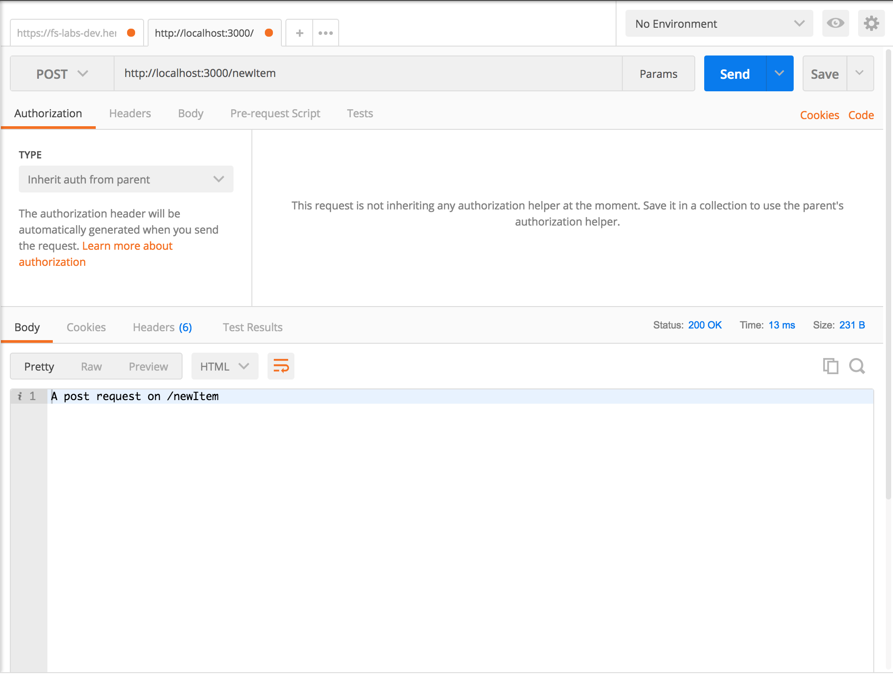
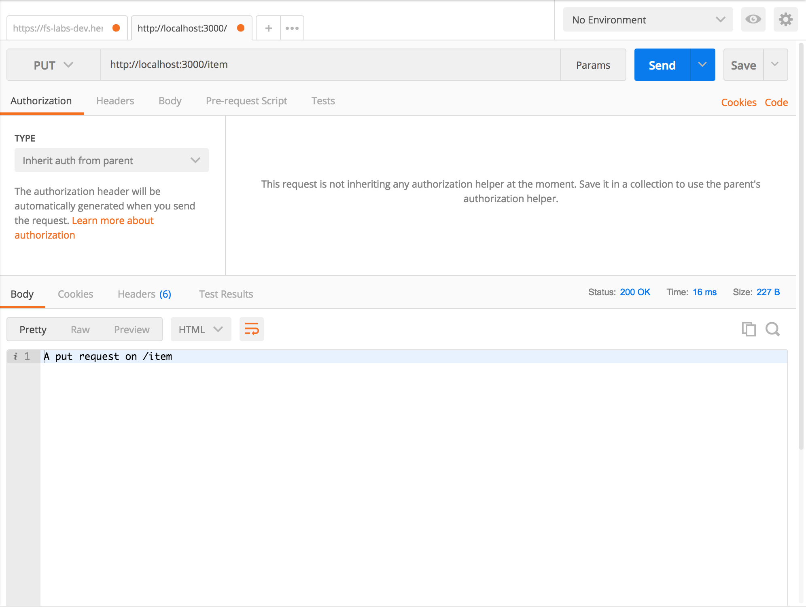
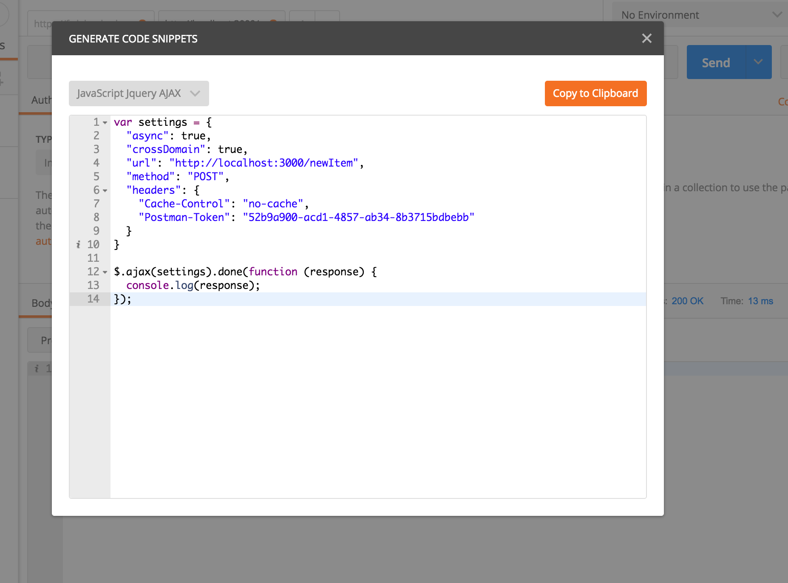

# express routes [https://expressjs.com/en/guide/routing.html](https://expressjs.com/en/guide/routing.html)

Routing in express is very simple: 

1. create the express app

2. use the desired http method

3. all methods take the route as the first argument and a callback function as a second argument. The callback provides a request object and a response object. These objects are essential to create server/client interaction.

Check the objects properties:

[req](https://expressjs.com/en/api.html#req)

[res](https://expressjs.com/en/api.html#res)

```javascript
import express from 'express';
const app = express();
const PORT = 3000;

app.get('/', (req, res) => 
  res.send(`A get request on ${req.url}`)
);

app.post('/newItem', (req, res) => 
  res.send(`A post request on ${req.url}`)
);

app.put('/item', (req, res) => 
  res.send(`A put request on ${req.url}`)
);

app.delete('/item', (req, res) => 
  res.send(`A delete request on ${req.url}`)
);

app.listen(PORT, () => 
  console.log('Server listening on http://localhost:3000')
);
```


> To test the post/put/delete--get is called when "/"" loads--endpoints before we build the client facing app we can use [postman](https://www.getpostman.com/) or [curl commands](https://www.rosehosting.com/blog/curl-command-examples/)

Postman screenshots:

POST


PUT


DELETE


Postman has a cool "code" feature(link on the right hand side of the panel) that generates code to make the request in different languages, including javascript client side AJAX:




