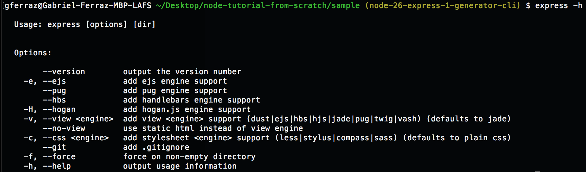

#create an express app using [express-generator](https://expressjs.com/en/starter/generator.html)

1. Install express-generator globally: `npm i -g express-generator`
2. Use `express -h` to check the options express-generator provides for view template engines, css compilers, etc

3. Create a project with your chosen options by using the corresponding flags e.g. 
`express --view=ejs --css=sass <project-name>`, (or just use the default): `express <project-name>` 
3. cd into project `cd project-name` and install dependencies: `npm install`
4. Run app: `npm start` and open browser on http://localhost:3000

### The app should have 

1.) a 'bin' directory, which is the entry point for the application (`npm start` executes that file)

2.) a 'public' directory with child directories (images, javascript, stylesheets)

3.) a 'routes' directory with simple two simple demo routes 

4.) a views directory with a simple demo views

5.) an `app.js` file with the app's configuration
