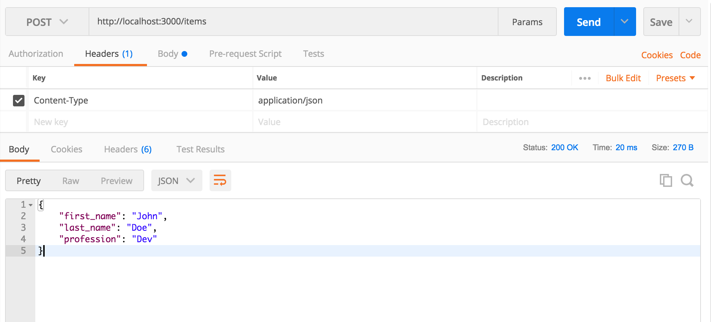
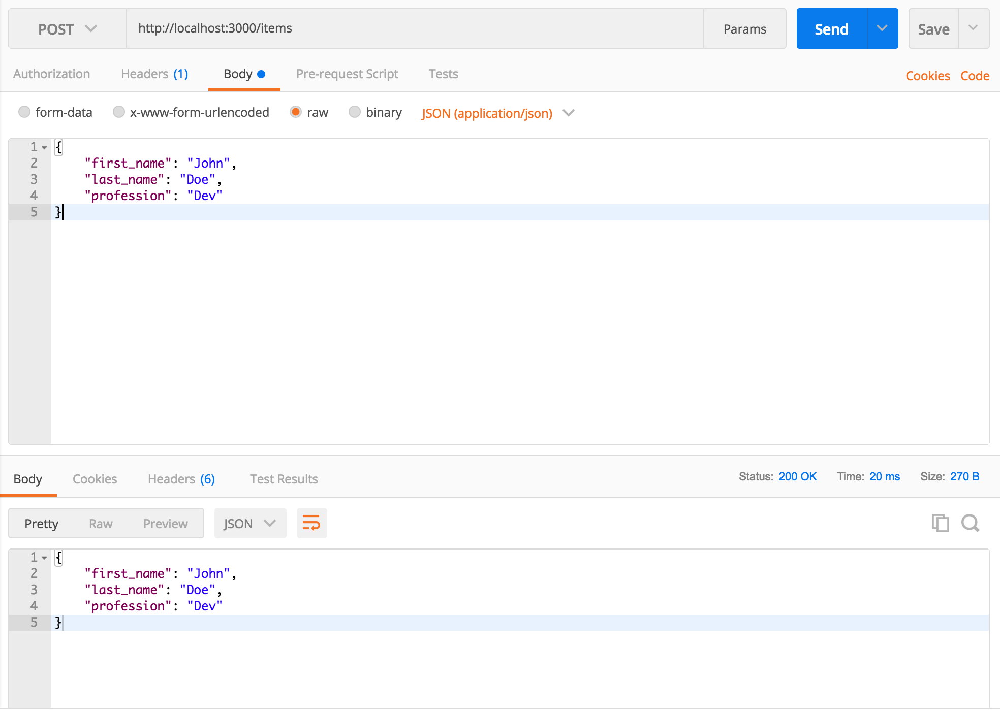
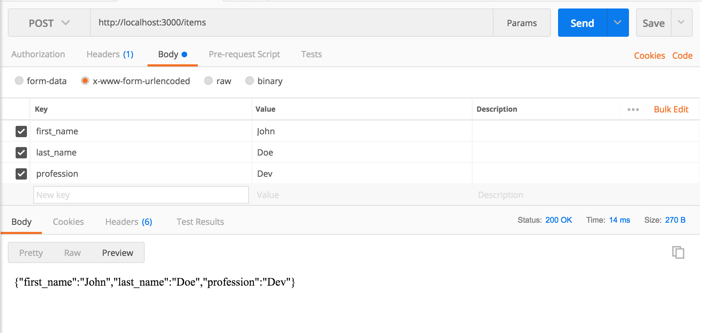
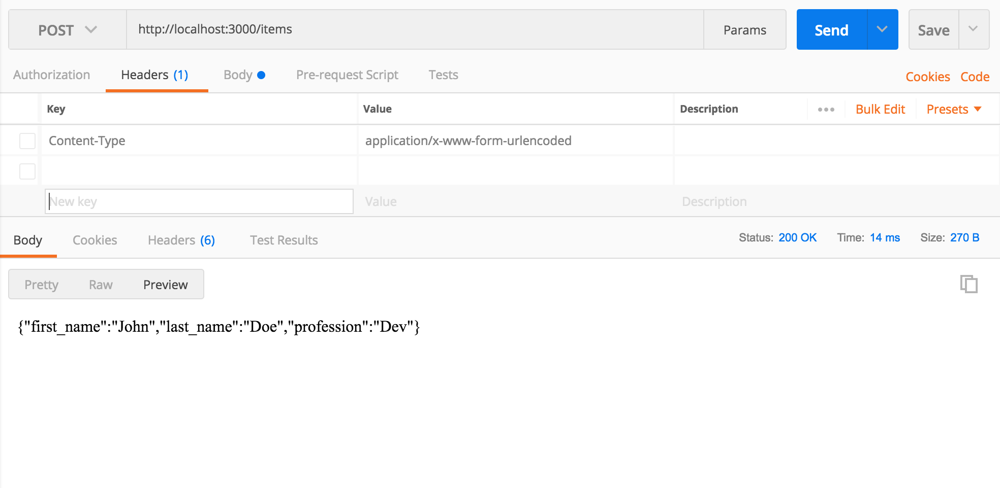

# middleware in express

In express, middleware are functions that get invoked in the router callbacks. There are several built in middlewares but we can also write our own middlewares.

In many cases we will pass the middleware as an argument to `app.use(middleware)`. Unless we specify the route for that middleware by passing the route as the first argument to the "use" function (i.e. `app.use('\', middleware)`) the middleware will be used for all routes. 

We have used some third party and built-in middlewares up to this point, such as "bodyParser", "cors", and "express.static()"

```javascript
app.use(bodyParser.json());
app.use(bodyParser.urlencoded({extended: false}));
app.use(cors());
```

We can also write our own middleware and pass it to `app.use(customMiddleware)` directly or put it in the body of the callback function of the route in which we want to use the middleware:

```javascript
app.get('/', (req, res) => {
  
  // anything that happens here before we send data
  // is considered middleware

  res.send(someData);
});
``` 

In this demo we will use `express.json()` and `express.urlencoded({extended: true})`, which work exactly like "bodyParser" but is now part of the core express library (body-parser is also an express library--not third-party--but it is shipped separately: [body-parser](https://expressjs.com/en/resources/middleware/body-parser.html)).

We will also use postman to post json data and urlencoded data to the server.

## POSTMAN

__JSON PARSE__

__header__


__body__



__URLENCODED PARSE__

__header__


__body__



